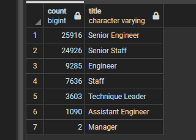
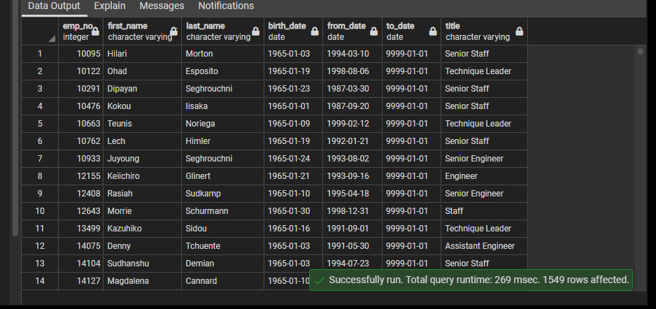

# Pewlett-Hackard-Analysis

## Overview

I have been working with Bobby at Pewlett-Hackard to create a Postgres database containing all of the company's employees, for the initial purposes of analyzing the number of employees approaching retirement age to assist in the company's near-term planning. As the number of potential retirees in the coming years is rather large - termed internally as a "silver tsunami" - Bobby's manager has now asked us to tally the number of retirement-aged employees per job title, as well as identify employees who would be eligible to join an employee mentorship program to train younger employees to be able to fill the shoes of those soon leaving the company. 

## Results
Results: Provide a bulleted list with four major points from the two analysis deliverables. Use images as support where needed.

As somewhat implied by the above summary, when presented with the somewhat staggering number of potential retirees (nearly 72,500!), our leadership at Pewlett immediately concluded more drilled-down data was needed to determine where within the company the impacts would be felt most. 

As we can see from the Titles summary:

- The vast majority of retiring employees - over 50,000 - are senior-level, and will be taking with them a breadth and depth of institutional knowledge
- Pewlett-Hackard will be losing over 36,000 engineers and over 32,000 staff, as well as 3,600 Technique Leaders and 2 managers - and while not being a siginificant number of employees, the two retiring managers *do* comprise a decent proportion of current management. 
- We can see that not only are we losing high-level employees, but certain specific employee types that aren't easily replacable. 

In looking at our eligible employee mentors, specifically those born in 1965, 

- We can see that even the among small sample PgAdmin returns 
    - shows the exact titles we are looking to train for. We certainly should examine the mentorship group further, but so far, the group appears to be who we're looking for. 
    - shows employees with many years of experience within Pewlett-Hackard, who undoubtedly know the company's standards and procedures.

## Summary

If filled at exactly the same experience levels and competencies, Pewlett-Hackard would need to replace nearly 72,500 roles (72,458) after the coming "silver tsunami." After querying the employee database, it appears the company currently has the required staff to fill these high-level roles.

At first glance 
